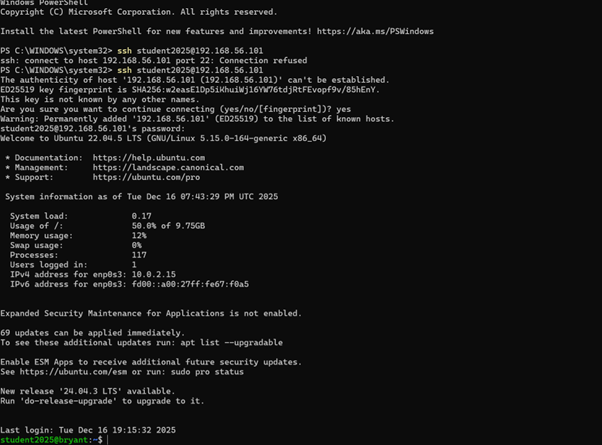
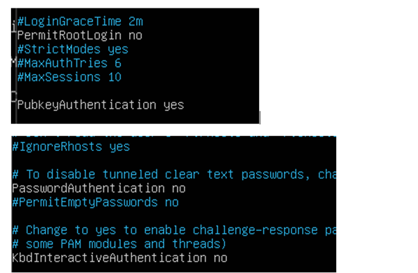

### SSH Access Verification

Remote administration was verified by successfully connecting to the server via SSH
from the Windows workstation using key-based authentication.

### SSH Hardening Configuration

The SSH daemon was hardened by disabling root login and password-based authentication,
while enforcing public key authentication. These changes reduce the risk of brute-force
attacks and unauthorised administrative access.

### Firewall Configuration

A firewall was configured using UFW to deny all unsolicited inbound traffic while
explicitly allowing SSH access. This limits network exposure while maintaining
remote administrative connectivity.

The server’s IP address was identified using the `ip addr` command to enable SSH access
from the workstation.
